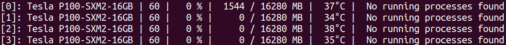

# gpuinfo

[](https://crates.io/crates/gpuinfo)
[](LICENSE)
[](https://deps.rs/repo/github/BDHU/gpuinfo)


A small command-line tool used to query and monitor GPU status.



NOTE: We only support NVIDIA GPU currently, AMD GPU is not yet supported. All contributions are welcome! This is an ongoing project and there might be changes in the future.

Usage
-----


```bash
$ gpu-info
```

Options:

* `-w`, `--watch`: Prints GPU information to terminal every second
* `-i`, `--interval <interval>`: Prints GPU information to terminal according to given interval (integer seconds)

NOTE: more options are to be added.

Installation
------------

The crate is publicly available at [crates.io](https://crates.io/crates/gpuinfo/0.1.0):

```bash
cargo install gpuinfo
```

Output
------

> [0]: Tesla P100-SXM2-16GB | 60 |   0 % |  1544 / 16280 MB |  37°C | No running processes found

* `[0]`: PCI_BUS_ID of the GPU. Beware that CUDA might assign different device ID. Ensure `CUDA_DEVICE_ORDER` is assigned `PCI_BUS_ID` will guarantee both `gpu-info` and CUDA yield the same result
* `Tesla P100-SXM2-16GB`: Name of the GPU
* `60`: Major and minor number of the GPU
* `0 %`: Current GPU utilization rate
* `1544 / 16280 MB`: GPU device memory usage
* `37°C`: GPU temperature
* `No running processes found`: Currently running processes on the GPU (note: only processes the user have privilege to access are shown).

License
-------

[MIT License](LICENSE)
